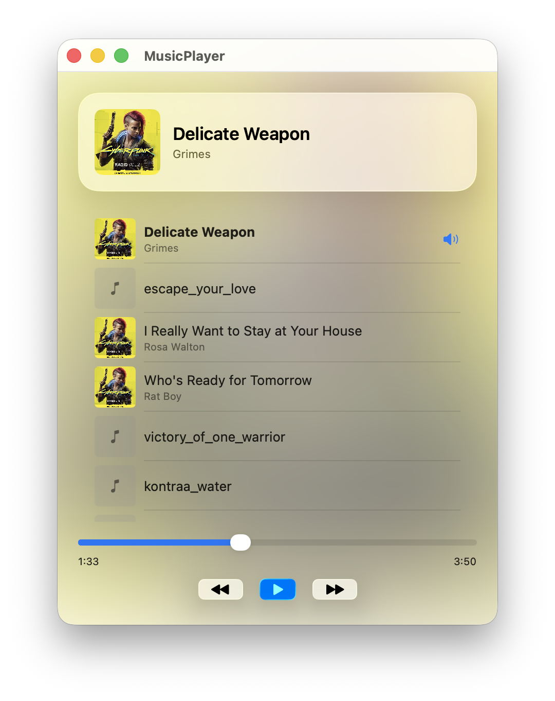
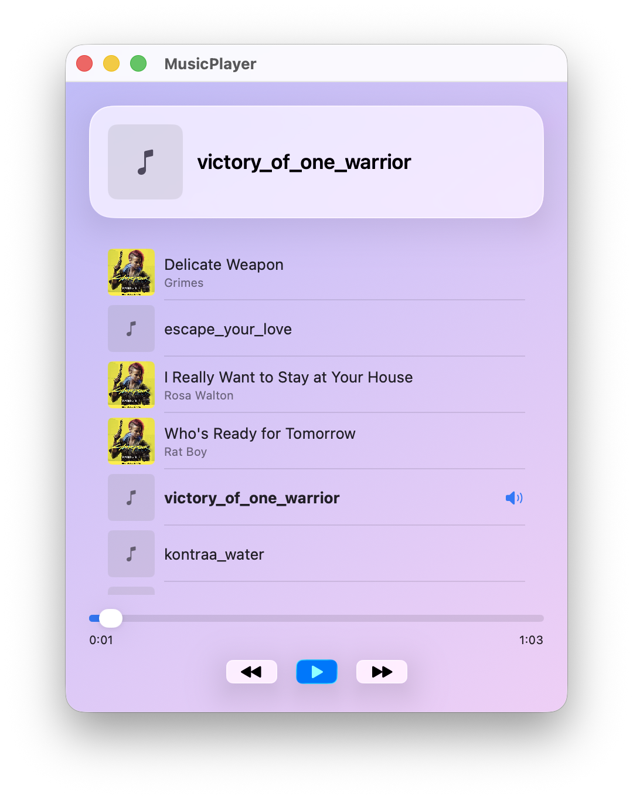
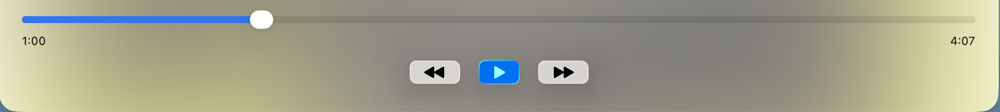

# MusicPlayer

A native macOS music player built with SwiftUI and the MVVM architecture, featuring real ID3 metadata, system-folder library loading, and an interface designed with Apple's Liquid Glass material. Built as a learning project to practice modern Swift and SwiftUI on macOS.

## Screenshots

| Now Playing | Library | Controls |
|---|---|---|
|  |  |  |

## Features

- Native macOS app with **Liquid Glass** styling (dynamic blurred background, glass cards and controls).
- Auto-scans `~/Music` at launch — no panels, no bookmarks. Library survives between launches via the filesystem.
- Reads real **ID3 metadata** (title, artist, artwork) from MP3 files via the modern `AVURLAsset` async API.
- Full transport controls: Play / Pause / Next / Previous, with auto-advance at end of track.
- Progress slider with `mm:ss` labels, seeking on release, no UI tug-back while scrubbing.
- Now-playing card with cover art and artist; per-row cover art in the library list.
- Unit tests covering the ViewModel.

## Tech stack

- **Language:** Swift 5.9+
- **UI:** SwiftUI + Liquid Glass (`.glassEffect`, `GlassEffectContainer`, `.buttonStyle(.glass/.glassProminent)`)
- **State:** `@Observable` (Observation framework) + `@Bindable`
- **Audio:** AVFoundation (`AVAudioPlayer` for playback, `AVURLAsset.load(.commonMetadata)` for tags)
- **Concurrency:** Swift Concurrency — `async/await`, `@MainActor`, `Task`, `nonisolated`
- **Library:** `FileManager` against the sandboxed `~/Music` directory
- **Testing:** Swift Testing (`@Test`, `#expect`)

## Architecture

The project follows MVVM with a strict separation of responsibilities:

```
MusicPlayer/
├── Models/         Pure data structures (Song). No UI, no AVFoundation.
├── ViewModels/     Observable state + business logic. Owns the AVAudioPlayer.
└── Views/          SwiftUI views. Read state from the ViewModel, dispatch actions.
```

Rules of thumb:

- The View observes the ViewModel. The ViewModel does not know the View exists.
- ViewModels are `@MainActor @Observable class` to guarantee UI updates on the main thread.
- Models are immutable `struct`s, `Identifiable` and `Hashable`.
- AVFoundation lives only inside the ViewModel — the Model imports only `Foundation`.

## How the library works

The app uses macOS's **Music Folder** sandbox entitlement (`com.apple.security.assets.music.read-only`) to access `~/Music` directly. On launch the ViewModel:

1. Locates `~/Music` via `FileManager.urls(for: .musicDirectory, in: .userDomainMask)`.
2. Resolves the sandboxed symlink with `URL.resolvingSymlinksInPath()`.
3. Lists `.mp3` files in the directory.
4. For each file, runs a synchronous `AVAudioPlayer` probe to read duration and an async `AVURLAsset` load to extract `commonMetadata` (title, artist, artwork).
5. Populates `@Observable var songs: [Song]` and the SwiftUI list refreshes automatically.

There is no separate persistence layer — the filesystem is the library.

## Requirements

- **macOS 26 (Tahoe) or later** — required for Liquid Glass APIs.
- **Xcode 26+**.

## Build and run

1. Open `MusicPlayer.xcodeproj` in Xcode.
2. Select the `MusicPlayer` scheme.
3. Run with `Cmd + R`.

Optional: drop your own `.mp3` files into `~/Music` to populate the library. They will appear next time the app launches.

## Testing

Run the test suite with `Cmd + U`. The suite covers the ViewModel logic — initial state, playlist navigation, edge cases at the start/end of the library, play/pause toggling, and seeking. The ViewModel exposes an `init(songs:)` initializer used by tests to inject fixture songs.

## Project status

Feature-complete for the original learning scope. Potential follow-ups (not yet implemented):

- Shuffle and repeat modes.
- `File → Open…` menu command with `Cmd + O`.
- Drag & drop of audio files onto the window.
- Volume control.
- Parallel metadata loading with `withTaskGroup` (current implementation is sequential).

## License

No license has been declared. Until a license is added, all rights are reserved by the author.
